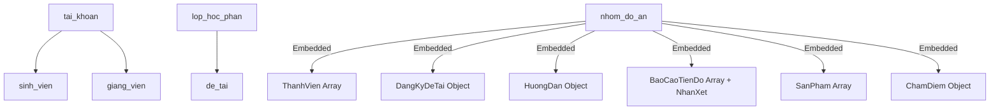

# 🎓 HỆ THỐNG QUẢN LÝ ĐỒ ÁN & KHÓA LUẬN TỐT NGHIỆP (HUIT) - NOSQL MONGODB


Hệ thống Quản lý Đồ án & Khóa luận Tốt nghiệp trực tuyến dành riêng cho **Sinh viên, Giảng viên và Quản trị viên (Admin)** Trường Đại Học Công Thương TP. Hồ Chí Minh (HUIT). 

Dự án được xây dựng chuẩn kiến trúc CSDL **MongoDB (NoSQL Document Store)**, tối ưu hóa truy vấn tài liệu nhúng (Embedded Documents), tích hợp công cụ **MongoDB Compass** và công cụ đánh giá tiến độ thông minh **AI Assistant (Gemini 2.5 Flash Academic Edition)**.

> [!NOTE]
> **Repository GitHub Chính thức:**  
> [https://github.com/NguyenThi-ThuyDuong/Student-Project-Management-System-Using-MongoDB.git](https://github.com/NguyenThi-ThuyDuong/Student-Project-Management-System-Using-MongoDB.git)

---

## 🌟 1. Tính Năng Nổi Bật

### 👨‍🎓 Đối với Sinh Viên
- **Quản lý Nhóm Đồ án:** Tạo nhóm, mời thành viên qua MSSV, chấp nhận/từ chối lời mời gia nhập nhóm.
- **Đăng ký Đề tài:** Chọn đề tài từ danh sách giảng viên công bố hoặc đề xuất đề tài mới.
- **Nộp Báo cáo Tiến độ (5 Giai đoạn):** Nộp file báo cáo PDF/Word, đính kèm link GitHub Source Code.
- **Nộp Sản phẩm & Theo dõi Điểm:** Nộp sản phẩm đồ án hoàn chỉnh, xem nhận xét và điểm số từ Giảng viên.

### 👨‍🏫 Đối với Giảng Viên
- **Quản lý & Đề xuất Đề tài:** Tạo đề tài cho Lớp học phần, quản lý hạn đăng ký, hạn nộp báo cáo.
- **Phê duyệt Đăng ký Đề tài:** Phê duyệt hoặc từ chối đề tài do sinh viên đề xuất.
- **Đánh Giá Tiến Độ Tích hợp AI (AI Assist):**
  - **Tóm tắt AI (AI SUMMARY):** Tự động phân tích báo cáo PDF/Word, tổng hợp *Công việc hoàn thành*, *Khó khăn gặp phải* và *Kế hoạch tuần tới*.
  - **Xem trước Báo cáo PDF:** Bộ xem tài liệu tương tác hỗ trợ chuyển trang, zoom và hiển thị trực tiếp.
  - **Nhận xét & Duyệt tiến độ:** Nhập phản hồi và phê duyệt từng lần nộp của sinh viên.
- **Quản lý Sản phẩm & Chấm điểm:** Đánh giá điểm báo cáo, điểm bảo vệ và tổng kết điểm đồ án.

### 🏛️ Đối với Quản Trị Viên (Admin)
- **Quản lý Danh mục Core:** Quản lý Bộ môn, Ngành học, Lớp hành chính, Môn học, Học kỳ, Lớp học phần.
- **Phân công Giảng viên:** Phân công GVCN lớp hành chính và Giảng viên phụ trách Lớp học phần.
- **Quản lý & Phê duyệt Đề tài Toàn trường:** Duyệt/từ chối đề tài do giảng viên và sinh viên đề xuất.
- **Giám sát Tiến độ & Thống kê:** Báo cáo thống kê tiến độ đồ án toàn trường, theo dõi các nhóm chậm tiến độ.

---

## 🏗️ 2. Kiến Trúc Cơ Sở Dữ Liệu NoSQL (MongoDB)

Dự án tận dụng tối đa sức mạnh của MongoDB để lưu trữ dữ liệu dưới dạng tài liệu (Document) linh hoạt:



### Cấu trúc Embedded Documents tiêu biểu (`nhom_do_an` collection):
* `ThanhVien`: Danh sách mảng nhúng thông tin sinh viên & vai trò (Trưởng nhóm, Thành viên).
* `DangKyDeTai`: Thông tin đề tài đã đăng ký & trạng thái phê duyệt.
* `HuongDan`: Thông tin giảng viên hướng dẫn phân công.
* `BaoCaoTienDo`: Mảng nhúng đợt nộp báo cáo kèm danh sách nhận xét `NhanXet`.
* `SanPham`: Mảng nhúng sản phẩm hoàn chỉnh & link repository GitHub.
* `ChamDiem`: Đối tượng lưu điểm báo cáo, điểm bảo vệ, điểm tổng kết và nhận xét cuối kỳ.

---

## 📌 3. Vì Sao KHÔNG Sử Dụng `DatabaseSeeder` MySQL Truyền Thống?

1. **Chuẩn hóa quy trình NoSQL thuần:** Dữ liệu và cấu trúc tài liệu (JSON/BSON) được tạo và quản lý trực tiếp thông qua các công cụ NoSQL chuẩn (`mongosh`, MongoDB Compass).
2. **Quản lý Schema Validation & Indexes bằng JavaScript:** MongoDB hỗ trợ JSON Schema Validation (`$jsonSchema`), Unique Index, Compound Index, và Text Index qua bộ script `.js`.
3. **Quản lý trực quan trên MongoDB Compass:** Toàn bộ Collections, Document structures, Embedded arrays hiển thị trực quan và chuẩn xác 100% trên GUI của **MongoDB Compass**.

---

## 🛠️ 4. Hướng Dẫn Cài Đặt & Khởi Tạo Dữ Liệu

### Bước 4.1. Cài đặt MongoDB Service & Extension PHP
- Cài đặt **MongoDB Community Server** (Cổng mặc định: `27017`).
- Bật extension `php_mongodb.dll` trong `php.ini`:
  ```ini
  extension=mongodb
  ```

### Bước 4.2. Khởi tạo Cơ sở dữ liệu MongoDB
Sử dụng script nạp tự động trong thư mục `mongodb/`:

#### Cách 1: Chạy Master Script qua Terminal (`mongosh`)
```bash
mongosh mongodb://127.0.0.1:27017/quanly_doan mongodb/run_all.js
```

#### Cách 2: Chạy qua File Batch (Windows)
Double-click hoặc chạy lệnh trong terminal:
```cmd
.\run_mongodb.bat
```

#### Cách 3: Nạp kịch bản dữ liệu kiểm thử Laravel PHP
```bash
php scratch/seed_kich_ban_test.php
```

---

## 🔗 5. Cấu Hình Laravel Kết Nối MongoDB

### File `.env`:
```env
DB_CONNECTION=mongodb
DB_HOST=127.0.0.1
DB_PORT=27017
DB_DATABASE=quanly_doan
DB_USERNAME=
DB_PASSWORD=
```

### File `config/database.php`:
```php
'mongodb' => [
    'driver'   => 'mongodb',
    'host'     => env('DB_HOST', '127.0.0.1'),
    'port'     => env('DB_PORT', 27017),
    'database' => env('DB_DATABASE', 'quanly_doan'),
    'username' => env('DB_USERNAME', ''),
    'password' => env('DB_PASSWORD', ''),
    'options'  => [
        'database' => env('DB_AUTHENTICATION_DATABASE', 'admin'),
    ],
],
```

---

## 🚀 6. Khởi Chạy Ứng Dụng

### 1. Cài đặt các gói phụ thuộc:
```bash
composer install
npm install
npm run build
```

### 2. Khởi chạy Server Laravel:
```bash
php artisan serve
```
Truy cập ứng dụng tại: **[http://127.0.0.1:8000](http://127.0.0.1:8000)**

---

## 🔑 7. Tài Khoản Đăng Nhập Kiểm Thử

| Vai Trò | Tên Đăng Nhập | Mật Khẩu | Ghi Chú |
|:---|:---|:---|:---|
| **Quản Trị Viên (Admin)** | `admin` | `123456` | Quản trị toàn bộ hệ thống |
| **Giảng Viên Phụ Trách** | `gv100` | `123456` | Tiến sĩ Nguyễn Văn A (GV100) |
| **Giảng Viên Mẫu** | `gv01`, `gv02`, ... | `123456` | Danh sách Giảng viên HUIT |
| **Sinh Viên (Nhóm trưởng)** | `sv100` | `123456` | Trần Văn Nam (SV100) |
| **Sinh Viên (Thành viên)** | `sv200` | `123456` | Lê Thị Hoa (SV200) |

---

## 📤 8. Hướng Dẫn Đẩy Code Lên GitHub

Nếu bạn cần đẩy các thay đổi mới lên repository GitHub chính thức:

```bash
git add .
git commit -m "Feat: Complete Student Project Management System with Laravel & MongoDB"
git remote set-url origin https://github.com/NguyenThi-ThuyDuong/Student-Project-Management-System-Using-MongoDB.git
git push -u origin main
```

---

## 📄 Bản Quyền (License)
Đồ án thuộc bản quyền sinh viên Trường Đại Học Công Thương TP. Hồ Chí Minh (HUIT). Giấy phép mã nguồn [MIT License](LICENSE).
